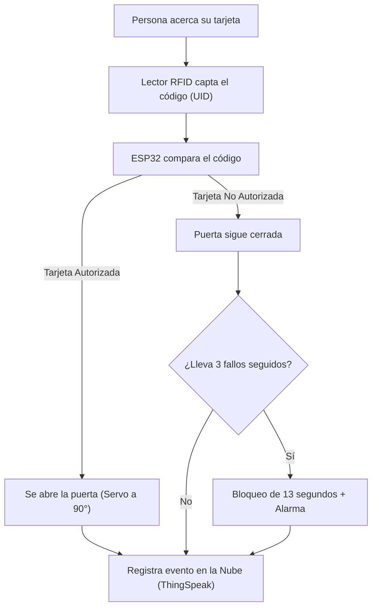

# Arquitectura del Sistema de Control de Acceso IoT

Este documento explica cómo funciona nuestro sistema inteligente de control de acceso.

---

## ¿Qué hace este proyecto?

Imagina un portero automático e inteligente para una puerta de seguridad:

1. **Lees una tarjeta:** La persona acerca su tarjeta o llavero RFID al lector.
2. **El cerebro (ESP32) decide:** Revisa si el código de la tarjeta está registrado en su lista de acceso autorizado.
3. **Acción en la puerta:** 
   - **Si la tarjeta es correcta:** Abre la puerta (el servomotor gira) y enciende el indicador LED.
   - **Si la tarjeta es incorrecta:** Mantiene la puerta cerrada.
   - **Si hay 3 intentos fallidos seguidos:** El sistema se alerta y **bloquea la puerta por 13 segundos** como medida de seguridad.
4. **Reporte a Internet:** Todo evento (accesos concedidos o rechazos) se envía por Wi-Fi a una plataforma en la nube (**ThingSpeak**) para ser monitoreado desde cualquier lugar.

---

## ¿Cuáles son las partes del sistema?

El sistema se divide en **4 bloques principales**:

| Componente | ¿Qué es? | ¿Qué función cumple? |
| :--- | :--- | :--- |
| **Lector RFID (RC522)** | El "Escáner" | Lee el código único (UID) de la tarjeta o llavero de la persona. |
| **ESP32** | El "Cerebro" | Procesador que toma decisiones, controla los sensores y se conecta a Wi-Fi. |
| **Servomotor** | El "Pestillo" | Gira a **90°** para abrir la puerta y regresa a **0°** para asegurarla. |
| **Plataforma Nube (ThingSpeak)** | La "Bitácora Digital" | Recibe y guarda los datos de acceso para verlos desde una página web. |

---

## ¿Cómo fluye la información?

---

##  Reglas de Seguridad

- **Tarjeta Permitida:** Actualmente está configurada la tarjeta con el código único `30 4F 8E C0`.
- **Protección Anti-Intrusos:** Evita que alguien intente pasar muchas tarjetas al azar. Al tercer fallo, el sistema se congela 13 segundos.
- **Monitoreo Remoto:** No hace falta estar presente físicamente para saber qué ocurre en la puerta; los registros viajan por la red Wi-Fi en tiempo real.
